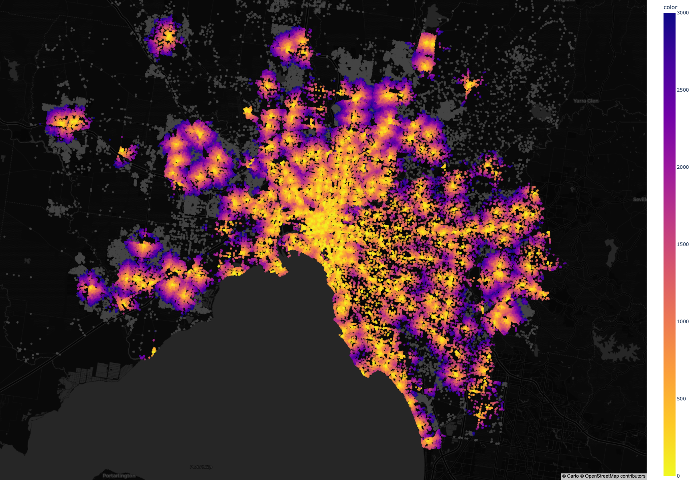
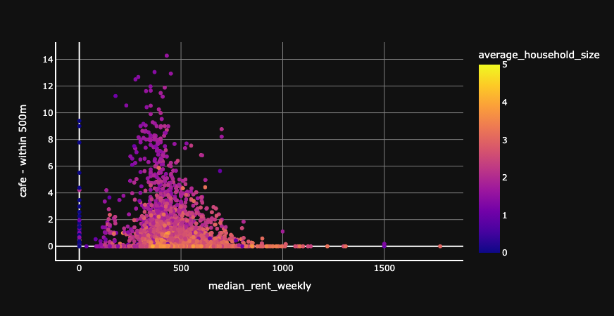

# Melbourne Coffee Index

Analysing Melbourne's walkability through graph navigation to the nearest coffee (and other things too)

## Components

Obtaining and processing the data takes a few steps, but many of the produced datasets are not that heavy and have been saved as feather files in `data/final/`. Many of the raw data imports from the census, for example, will need to be provided yourself (but instructions are listed in the appropriate notebooks)

The data is processed through three notebooks:

1. First, the data is ingested from raw sources and APIs in `data_ingestion.ipynb`. Data is created in feather files in `data/prepared/` for further processing.
2. Then, `graph_processing.ipynb` takes in all the prepared data, joins it together, generates the graph, and calculates the distances. Data is saved in `data/final/` for end use.
3. Finally, `visualisations.ipynb` includes some example maps, scatters, correlations and so on. This can be run entirely from the data in the repo, except for the feather file containing all network nodes and distances. The code will pull this file from an s3 bucket if necessary. Some images are saved in `plots/`

A (not-particularly-working) flask app can be found in `app.py` leveraging `templates/index.html` that exposes feather data as geojson for interactive visualisation.

## Installation and requirements

An `environment.yml` file has been provided to create the conda environment, but will require conda-forge. Solving the environment can also be difficult due to Pandana running on a C++ backend. 

Consult the `env.template` for the necessary contents of the `.env` file.

## Useful resources

I am indebted to Lenka Hasova's blog [with a useful reference implementation of Pandana](https://lenkahas.com/post/pandana.html). 

## The future

I will continue work on this to create a more polished version I will likely host as a kepler+react app and publish in collaboration with [YIMBY Melbourne](https://yimbymelbourne.com.au/).

